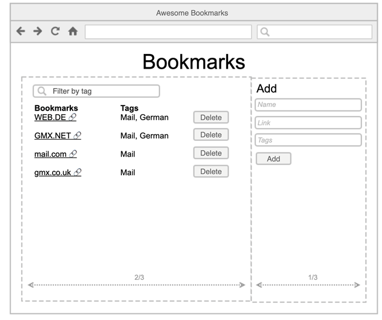

# Bookmarks Manager

## The Task

#### Functional requirements
Create an application that allows the user to manage bookmarks. They should be able to enter a name, link (URL) and a list of tags separated by comma.
The bookmarks should be displayed from the newest entries to the oldest ones. Users should be also able to filter bookmarks based on tags and delete bookmarks.
Here is a wireframe as a rough guide.



#### Non-functional requirements
- Make sure you write tests for some of the developed code. 
- Optional:
  - Keep the data persistent on browser reload.
  - Create a new service to load an initial set of bookmarks from a real server (iE. locally served JSON file) via HTTP.

## How to Run

To run main application you can open a terminal window and run:

```bash
npm start
```
I used [JSON Server](https://github.com/typicode/json-server) to create the "API" side. 
It should also be started in order to properly run the application. You need a new window and to 
run the command:  
```bash
npm start:mock
```


To run the unit tests once, run:

```
npm test
```